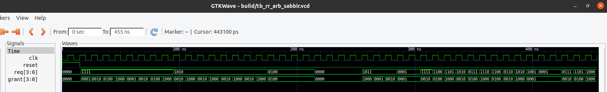

# Round Robin Arbiter

## Description
A **Round Robin Arbiter** is a hardware scheduling mechanism used to fairly allocate a shared resource among multiple requesters. When several clients simultaneously request access to a common resource, the arbiter decides which requester receives service.

Unlike a fixed-priority arbiter, where higher-priority requesters can continuously dominate access, a round robin arbiter rotates the priority after each successful grant. This ensures that every requester eventually receives service and prevents starvation.

In many digital systems, multiple modules compete for access to a shared resource such as:

- System buses
- Memory controllers
- DMA engines
- Network-on-Chip (NoC) routers
- Shared communication channels

If a fixed-priority arbitration scheme is used, lower-priority requesters may experience excessive delays or may never receive service when higher-priority requests are continuously active. This condition is known as **starvation**.

A round robin arbiter solves this problem by cyclically rotating the highest priority among all requesters. After a requester is granted access, its priority becomes the lowest, and the next requester in the sequence receives the highest priority. As a result, all requesters receive fair access to the shared resource over time.

---
## Overview
This project implements a parameterized Round Robin Arbiter in SystemVerilog. The arbiter fairly grants access among multiple requesters by rotating the priority after each successful grant.

The design uses:

- Request Rotation (Crossbar-1)
- Fixed Priority Arbiter
- Grant De-Rotation (Crossbar-2)
- Rotating Priority Pointer
---
## Features
- Parameterized number of requesters (N)
- Fair arbitration scheme
- Synthesizable RTL
- Self-checking testbench
- Directed and random verification tests
- VCD waveform generation
---

## Design Specification 
---
### Inputs
| Signal  | Width |  Description     |
|-------  |-------|------------------|
| `clk`   |  1    |  System Clock    |
| `reset` |  1    |  Active Reset    |
| `req`   |  N    |  Request Signals |
---
### Outputs
| Signal  | Width |     Description      |
|-------  |-------|----------------------|
| `grant` |  N    |  One Hot Grant Signal|
---
### Parameters
| Parameter | Description                                      |
| --------- | ------------------------------------------------ |
| `N`       | Number of requesters (scalable design parameter) |
| `PTR_W`   | Pointer width calculated as `$clog2(N)`          |
---
### Internal Signals
| Signal          | Width | Description                                                                  |
| --------------- | ----- | ---------------------------------------------------------------------------- |
| `ptr`           | PTR_W | Round-robin pointer indicating current highest priority requester            |
| `rotated_req`   | N     | Request vector after circular rotation based on `ptr`                        |
| `rotated_grant` | N     | Intermediate grant vector from fixed-priority arbitration before de-rotation |

## Architecture
---

----
## Functional Description

1. Request Rotation

The request vector is rotated according to the current priority pointer (ptr).

req[N-1:0] --> Rotator --> rotated_req[N-1:0]
This operation shifts the requeter with the highest priority to index 0.

2. Fixed-Priority Arbitration

The rotated request vector is processed using a fixed-priority arbiter.
rotated_req --> Fixed Priority Arbiter --> rotated_grant
The first active request is selected and a one-hot grant is generated.

3. Grant De-Rotation

The rotated grant is converted back to the original requester positions.
rotated_grant --> De-Rotator --> grant
The final output grant indicates which requester is selected.

Pointer Update Mechanism

After each successful grant, the pointer is updated as:
ptr_next = (granted_requester + 1) % N

If no request is active, the pointer remains unchanged.

**Reset Behavior**

When reset is asserted:

ptr = 0

This initializes the arbitration starting from requester 0.

Example: (N = 4)
| Pointer |	      Priority Order            |
|---------|---------------------------------|
|0	      |req[0] → req[1] → req[2] → req[3]|
|1	      |req[1] → req[2] → req[3] → req[0]|
|2	      |req[2] → req[3] → req[0] → req[1]|
|3	      |req[3] → req[0] → req[1] → req[2]|
---
## Simulation Waveform

The following waveform demonstrates the behavior of the Round Robin Arbiter implemented in SystemVerilog.  
It shows how the grant signal rotates fairly among requesters based on the internal pointer logic.

**Observation:**
- Grant rotates among active requests
- No requester is starved
- Pointer updates correctly after each grant
---
## Author

**Sabbir**
Email: sabbirhp440@gmail.com

